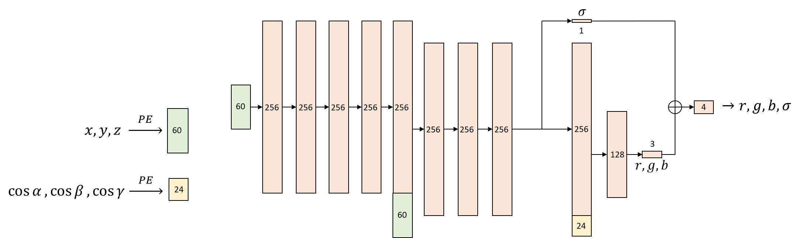
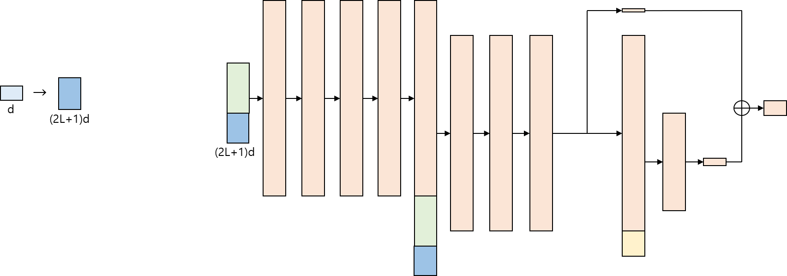
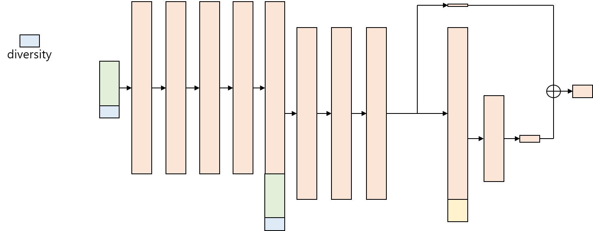
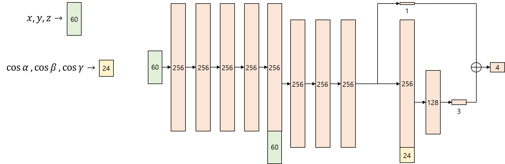

# MultiNeRF: Neural Radian Field for Multiple Objects
Inspired by [NeRF](https://arxiv.org/abs/2003.08934)(Ben Nildenhall, Pratul P. Srinivasan, Matthew Tancik, et al.), we purpose a new model that can contain several objects.

## Model A. Simple one-hot vector
The first model we tried is just simply concatenating a one-hot vector(with 1 at the index of the object in the object list) to the `input_ch`.

## Model B. Positional encoding
The next model we tried is the model using positional encoding to the vector that contains the information of the object; which was a one-hot vector with 1/diversity at one index. (`L = 3` in training)

## Model C. Keras embedding
Trying to avoid giving artificial information like a one-hot vector and indexing, we found an embedding layer named `tf.keras.layers.Embedding` that also learns how to embed each object into a vector.

## Model D. Convolutional encoder
We tried a lot of ways and found out we need some input that enables the model to recognize the object itself first to watch at different viewpoints with more stability, and also to receive other images that are not included in the training steps. So we tried to add an image encoder to make a vector that contains information of the objects and concatenate the vector to the input.
For every iteration, we randomly choose one image of each object in the dataset to set as a ‘base image’ for recognizing the object, put it through the 2D convolutional layers that resize both dimensions to half until it gets to size `[1, 1]` with feature size constant to 10, and flatten to concatenate with the input vector.

